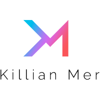

    

 

    Welcome to my page !   I'm Killian, a curious Fullstack developer from <b>France</b> graduated from a High-level engineering school

<h2 align="center">Things I code with</h2>

    
    
    
    
    
    
    

<!--
**KilMer56/KilMer56** is a ✨ _special_ ✨ repository because its `README.md` (this file) appears on your GitHub profile.

Here are some ideas to get you started:

- 🔭 I’m currently working on ...
- 🌱 I’m currently learning ...
- 👯 I’m looking to collaborate on ...
- 🤔 I’m looking for help with ...
- 💬 Ask me about ...
- 📫 How to reach me: ...
- 😄 Pronouns: ...
- ⚡ Fun fact: ...
-->
